# Results

## Segmentation scores

*Results of Unigram Model of several settings of min size, max size segments, seeds and iterations. For evaluating we used 5 score functions. For more information see [docs](./README.md#score-functions). The model name in the table is described by the format of 'VBM min_size-max_size-iterations-init_segmentation (seed)'. Seed is by default 0.*

|                        | **bacor accuracy (%)** | **bacor f1 (%)** | **mjww (%)** | **wtmf (%)** | **wufpc (pitches)** |
|------------------------|------------------------|------------------|--------------|--------------|---------------------|
| UM 4-6-20-gauss        | 92.69                  | 92.62            | 39.75        | 69.16        | 5.40                |
| UM 4-5-20-gauss        | 92.81                  | 92.75            | 36.20        | 60.55        | 5.97                |
| UM 3-5-1-gauss (0)     | 92.76                  | 92.71            | 35.96        | 59.39        | 5.95                |
| UM 3-5-5-gauss (0)     | 93.17                  | 93.13            | 36.38        | 60.00        | 5.86                |
| UM 3-5-10-gauss (0)    | 93.24                  | 93.20            | 36.46        | 59.98        | 5.83                |
| UM 3-5-20-gauss (0)    | 93.20                  | 92.96            | 36.61        | 60.02        | 5.84                |
| UM 3-5-1-gauss (153)   | 92.67                  | 92.60            | 35.97        | 59.42        | 5.93                |
| UM 3-5-5-gauss (153)   | 92.91                  | 92.87            | 36.45        | 60.00        | 5.84                |
| UM 3-5-10-gauss (153)  | 93.24                  | 93.19            | 36.39        | 59.87        | 5.85                |
| UM 3-5-20-gauss (153)  | **93.41**              | **93.36**        | 36.41        | 59.86        | 5.86                |
| UM 1-7-20-gauss        | 91.70                  | 91.61            | 41.95        | 77.72        | 5.11                |
| UM 2-8-20-gauss        | 89.66                  | 89.51            | 41.11        | 85.54        | 4.89                |
| UM 4-6-20-words        | 92.45                  | 92.37            | 39.91        | 69.12        | 5.41                |
| UM 4-5-20-words        | 93.10                  | 93.04            | 36.21        | 60.59        | 5.97                |
| UM 3-5-20-words        | 93.27                  | 93.22            | 36.93        | 60.20        | 5.88                |
| UM 1-7-20-words        | 92.02                  | 91.93            | 42.38        | 77.99        | 5.13                |
| UM 1-7-300-words       | 91.97                  | 91.89            | 42.16        | 77.90        | 5.12                |
| UM 2-8-20-words        | 89.90                  | 89.78            | 41.78        | 85.46        | 4.89                |
| UM 3-8-20-words        | 89.47                  | 89.36            | 41.94        | 85.63        | 4.90                |
| UM 3-8-300-words       | 90.12                  | 90.00            | 41.58        | 85.51        | 4.88                |
| UM 1-14-20-words       | 66.94                  | 67.09            | **45.27**    | **97.92**    | **3.75**            |

## Unigram Model - Iteration Statistics
### Bacor Acuracy (not tuned)
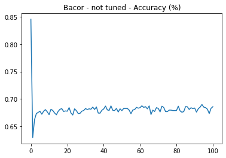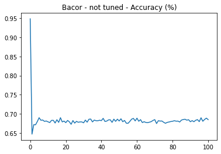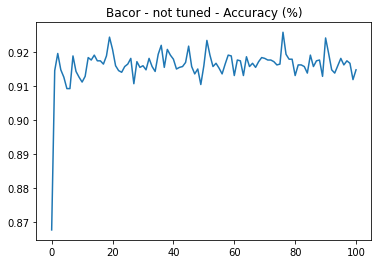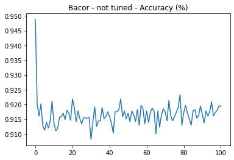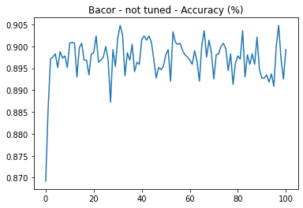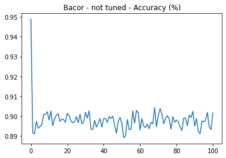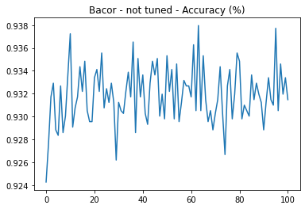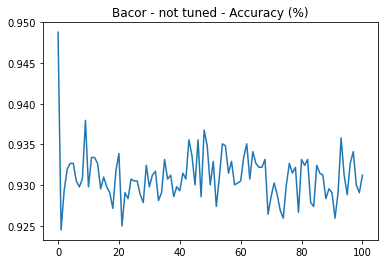
### Bacor F1 (not tuned)
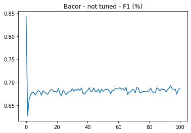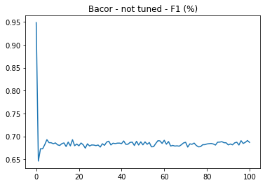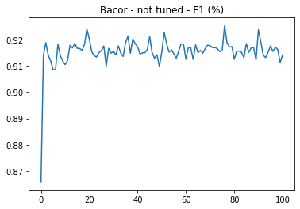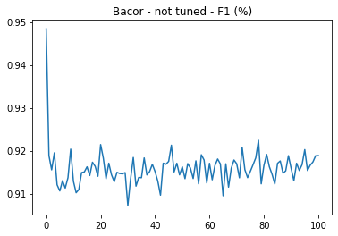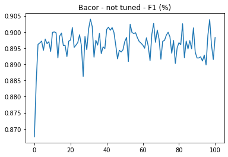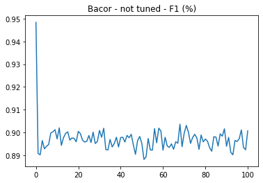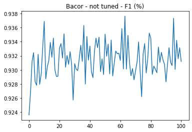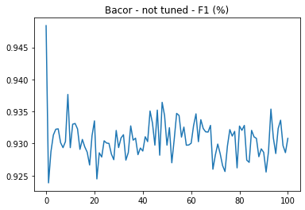
### MJWW
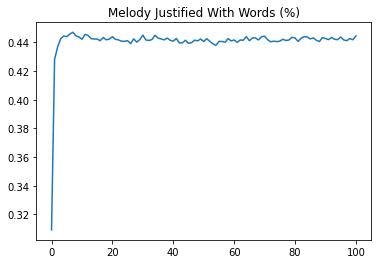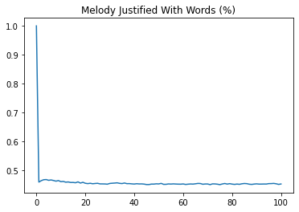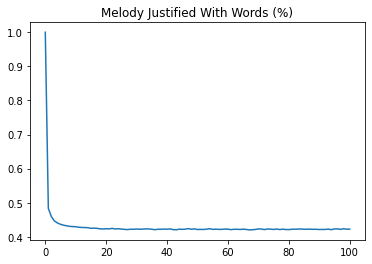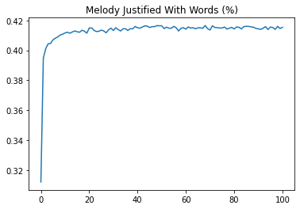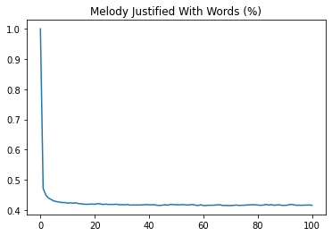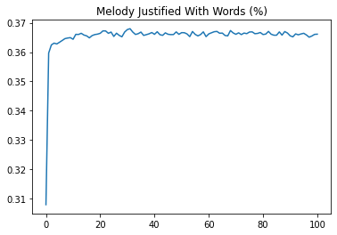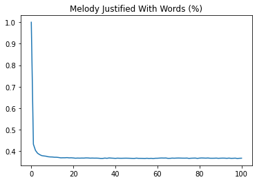
### WTMF
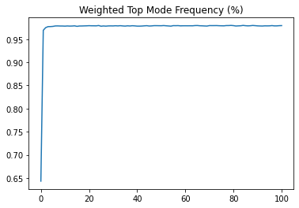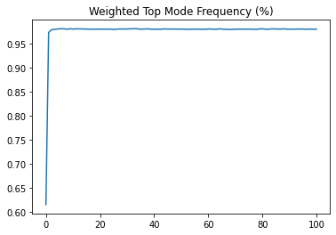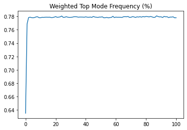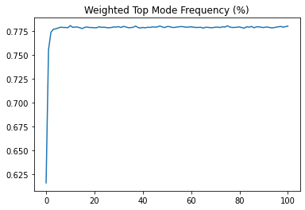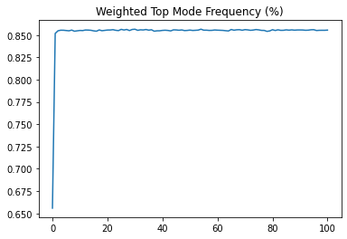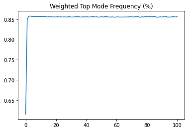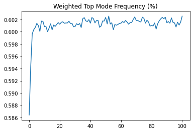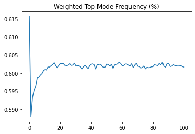
### WUFPC
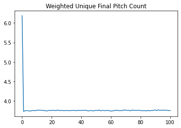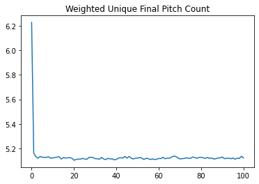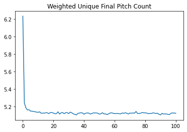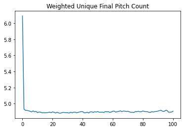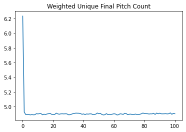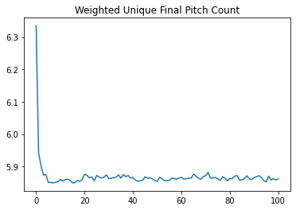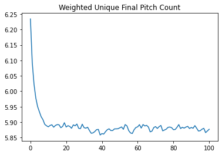
### Vocabulary Size
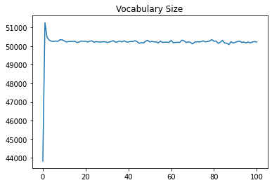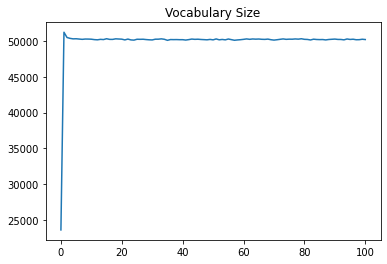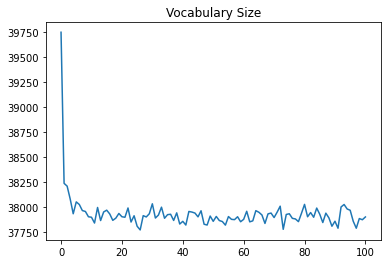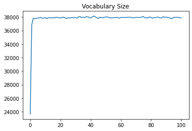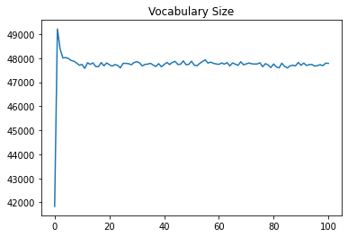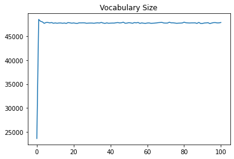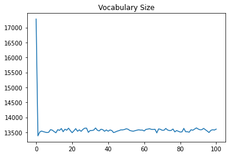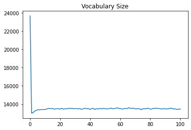
### Average Segment Length
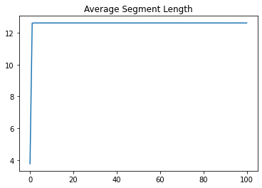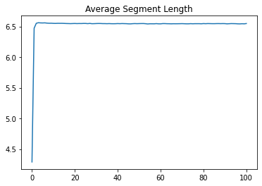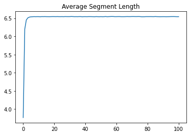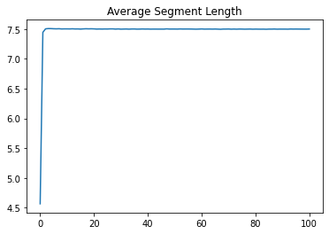

## Feature Extractions

### Frequencies of top 100 melodies

- Overlapping 4-grams
    
- Overlapping 5-grams
    
- Overlapping 6-grams
    
- Unigram Model (min size = 1, max size = 14, iterations = 100, init mode = gaussian)
    
- Unigram Model (min size = 1, max size = 14, iterations = 100, init mode = words)
    
- Unigram Model (min size = 1, max size = 7, iterations = 100, init mode = gaussian)
    
- Unigram Model (min size = 1, max size = 7, iterations = 100, init mode = words)
    
- Unigram Model (min size = 3, max size = 8, iterations = 100, init mode = gaussian)
    
- Unigram Model (min size = 3, max size = 8, iterations = 100, init mode = words)
    
- Unigram Model (min size = 3, max size = 5, iterations = 100, init mode = gaussian)
    
- Unigram Model (min size = 3, max size = 35, iterations = 100, init mode = words)
    